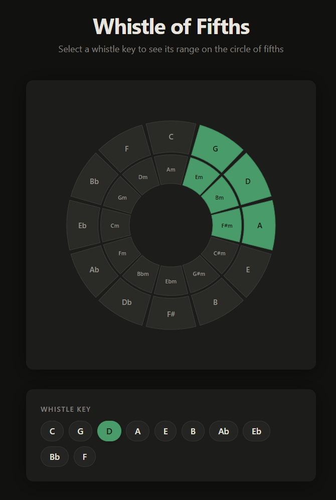

# Whistle of Fifths

<div align="center">
  
</div>

A web-based music education tool for Irish whistle players. Select a whistle key and see the corresponding zones highlighted on a circle of fifths — showing which major keys, minor keys, and modes fall within the natural range of that instrument. Useful for understanding what keys you can play in, how whistles relate to each other, and for making decisions when arranging or session playing.

## Getting started

**Prerequisites**: [Bun](https://bun.sh)

```bash
bun install
```

### Development

```bash
bun run dev
```

Starts a local server at [http://localhost:3000](http://localhost:3000).

### Build

```bash
bun run build
```

Bundles the app to `dist/`.

### Tests

```bash
bun run test
```
